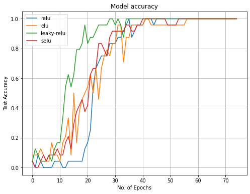
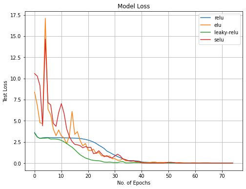
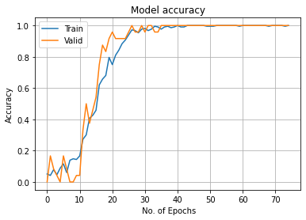
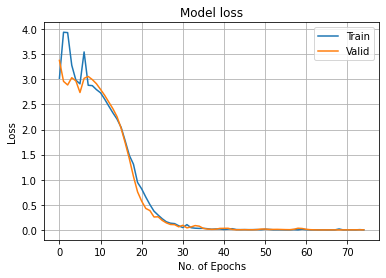

## Project 

**Perform Facial Recognition with Deep Learning in Keras Using CNN**

 
 
 

### Project Overview

**Problem Statement:** Facial recognition serves as a biometric method to identify individuals based on unique facial features. This technology has diverse applications, including flight check-in, automatic tagging of photos, and personalized advertising. The objective of this project is to develop a facial recognition system utilizing deep convolutional neural networks (CNNs) with the Keras framework.

**Objective:** Implement a deep convolutional neural network using Keras to accurately perform facial recognition tasks.

**Dataset Details:** The ORL (Olivetti Research Laboratory) face database consists of 400 images, each sized at 112x92 pixels. The dataset includes 40 distinct individuals, with 10 images per person. These images capture various conditions, such as different lighting, facial expressions, and slight variations in head orientation. All faces are in a frontal view with minimal rotation.

### Implementation Details

* [Program Code]() + [Dataset]()

**Dataset Preparation and Preprocessing:**
  * The ORL Faces Dataset is pre-split into training and testing sets. The training set contains 240 images, and the testing set comprises 160 images.
  * Each image was normalized to have pixel values in the range [0, 1] by dividing by 255.
  * The images were reshaped to match the input shape required by the CNN, i.e., (112, 92, 1).

**Model Architecture:**
  * A Convolutional Neural Network (CNN) was designed using the Keras Sequential API.
  * The architecture includes multiple convolutional layers with ReLU activation, followed by max-pooling layers.
  * Dense layers were added after flattening the convolutional layers' output.
  * Dropout layers were incorporated to prevent overfitting.
  * The final output layer uses softmax activation to classify the 40 distinct individuals.

**Activation Function Analysis:**
  * Various activation functions were evaluated, including 'relu', 'elu', 'leaky-relu', and 'selu'.
  * The 'leaky-relu' activation function was identified as the most effective for this model, providing the best convergence and accuracy.

**Training and Evaluation:**
  * The model was trained using the Adam optimizer with a learning rate schedule.
  * The training process utilized `x_train` and `y_train` arrays, with `x_valid` and `y_valid` serving as validation data.
  * The model was evaluated using the `x_test` and `y_test` arrays, achieving a test loss of approximately 0.2435 and an accuracy of 93.75%.

### Tools, Technologies, and Skills Used

- **Programming Languages:** Python
- **Libraries and Frameworks:**
  - **Data Science Libraries:** NumPy, Pandas, Matplotlib
  - **Machine Learning Libraries:** Scikit-learn
  - **Deep Learning Frameworks:** TensorFlow 2, Keras
- **Deep Learning Techniques:**
  - Convolutional Neural Networks (CNNs)
  - Activation Functions: ReLU, ELU, Leaky ReLU, SELU
  - Optimizers: Adam
  - Dropout and AlphaDropout for regularization
- **Dataset Handling:**
  - Loading and preprocessing image data
  - Train-test split
  - Data normalization
- **Model Training and Evaluation:**
  - Model compilation, fitting, and validation
  - Performance metrics: Accuracy, Loss
- **Visualization Tools:**
  - Matplotlib for plotting results
- **Development Environment:**
  - AWS SageMaker
  - TensorFlow 2 GPU optimized kernels
  - Compute Instance: 4 vCPU, 16 GiB RAM, 1 GPU

### Results (Figures)

  

 

  
  

 

  
  

 

The figures above illustrate the dataset, the performance of different activation functions during training, and the final model's accuracy and loss over epochs. The 'leaky-relu' activation function demonstrated superior performance, resulting in a high accuracy rate for facial recognition tasks.

